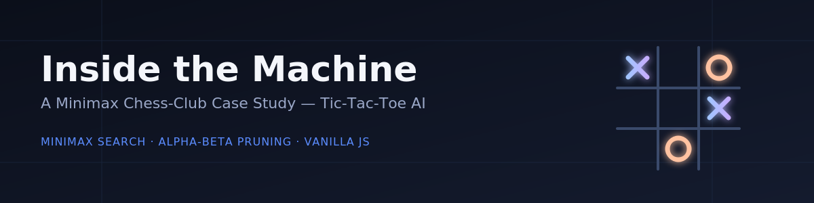

<p align="center">
  
</p>

<p align="center">
  <b>Project:</b> Simple Game-Playing AI (Minimax + Alpha-Beta Pruning)<br/>
  <b>Author:</b> Podalakuru Harika<br/>
  <b>Program:</b> Jyesta — Artificial Intelligence (Minor Project)<br/>
  <b>Batch:</b> 2026-06<br/>
</p>

<p align="center">
  🔗 <a href="https://harika7075.github.io/tic-tac-toe-ai/">Live Demo</a>
</p>

---

## 📌 Overview

Most AI demos are a black box: you make a move, something happens, you're told who won. This project exposes the reasoning behind every move — showing every candidate move the engine considered and why it picked the one it did — using **Minimax search with Alpha-Beta pruning**.

The live demo lets you play against the engine while a heatmap shows the score it calculated for every move it considered.

## 🎯 Features

- Fully playable Tic-Tac-Toe against an AI opponent
- Three difficulty levels: Easy, Medium, Unbeatable
- Real-time decision heatmap showing scores for every candidate move
- Live engine console: search depth, positions evaluated, branches pruned, chosen move score
- Alpha-Beta pruning optimization, with a visible counter showing branches pruned per move

## 🧠 How It Works

### 1. The Algorithm — Minimax

The engine doesn't just look for its best move — it looks for its best move *assuming the opponent also plays optimally in response, every time*.

1. **Simulate everything** — for every empty cell, the engine imagines placing its mark, then the opponent's best response, then its own best response to that, all the way to the end of the game.
2. **Score the ending** — each simulated game ends in a win, loss, or draw. Wins score `+10 − depth`, losses score `depth − 10`, so faster wins score higher and unavoidable losses are delayed as long as possible.
3. **Roll the score back up** — at the opponent's simulated turns, the engine assumes they pick the option worst for it; at its own turns, it picks the best option for itself.
4. **Play the highest-scoring move** — once every branch is scored, the engine plays the first move that leads to the best guaranteed outcome.

### 2. The Optimization — Alpha-Beta Pruning

Simulating every possible game gets expensive fast. Alpha-Beta pruning cuts off branches the moment it's provable that a rational opponent would never let the game reach them — without changing the final decision.

| | Positions Checked (first move) |
|---|---|
| No pruning | 549,946 |
| With pruning | ~18,000 |

The same move is chosen either way — pruning only removes branches that can't affect the answer.

## 🛠️ Built With

- HTML
- CSS
- Vanilla JavaScript (no frameworks, no server)

## 🚀 Getting Started

This is a single self-contained `index.html` file — no build step or server required.

1. Clone the repository
   ```bash
   git clone https://github.com/harika7075/tic-tac-toe-ai.git
   ```
2. Open `index.html` in any browser
3. Or just play the [live demo](https://harika7075.github.io/tic-tac-toe-ai/) directly

## 🔮 Future Extensions

- **Reinforcement Learning** — a Q-learning agent could learn move values through self-play, trading guaranteed correctness for the ability to handle games too large to fully search.
- **Connect Four / Chess** — larger state spaces make full search infeasible; the fix is to search a limited number of moves ahead and use a heuristic evaluation function (e.g. material count, board control) to estimate positions the engine can't fully resolve.

## 📄 License

This project was created as part of an academic/training submission.
